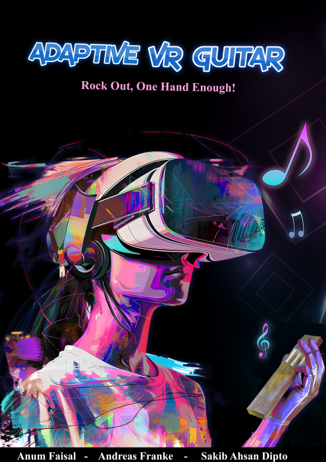

# Adaptive VR Guitar

**Slogan:** Rock Out — One Hand Is Enough!

  

---

## Introduction

**Adaptive VR Guitar** is an educational XR experience that helps individuals with **limited hand mobility** learn to play guitar chords in a **fun and immersive** way. By simulating a real guitar fretboard through a **wooden plank** fitted with **touch sensors**, the system enables users to **strum**, **press chords**, and **receive real-time feedback** in a virtual environment.

**The problem:**  
Many traditional instruments (like guitars) demand two fully functional hands, leaving individuals with **physical disabilities** feeling excluded from music-making.

**The proposed solution:**  
By merging **Arduino-based sensor input** with **Unity’s 3D engine**, we replicate the essential guitar experience in VR—**no left hand?** No problem! The interface is specifically adapted for one-handed or reduced mobility usage. This inclusive approach fosters a sense of **achievement**, **joy**, and **connection** to music.

---

## Design Process

### 1. Group Discussion
Our design process began with an **open group brainstorming session**, during which we:
- Used **Google Draw** to capture each member’s ideas.  
- Explored different ways to simulate guitar-playing in VR.  
- Emphasized inclusivity for people with **one-hand** or limited mobility.  

This collaborative approach established a **shared vision** for the project and guided us toward building a solution that feels both **intuitive** and **enjoyable**.

### 2. Storyline
We carefully crafted a **three-part narrative** to clarify the user journey:

- **Beginning:** Introduce the challenge of limited hand mobility in guitar playing.  
- **Middle:** Show the struggles and how the app addresses them (wooden plank with sensors, VR environment).  
- **End:** Present the final solution—an immersive guitar lesson that fosters empowerment and creativity.

### 3. Transition of Ideas
Originally, we considered a simple **pocket fretboard**. Over time, we evolved the concept into a **fingerless glove** attached to a **wooden plank** with **touch sensors**. This setup:
- Simplifies the user’s interaction.  
- Makes the transition from real to virtual more **seamless** (once you touch the plank, you enter the VR guitar lesson).  
- Keeps the user grounded and comfortable during the initial learning phase (e.g., using passthrough).

### 4. Idea Development
**Key innovations** emerged from user feedback and iterative design:
- **Touch sensors** embedded in a wooden plank to simulate a fretboard.  
- **Arduino microcontroller** processes sensor data and relays it to Unity.  
- **One-handed accessibility**: The interface and interaction mechanics are optimized for minimal hand usage.

Ultimately, this ensures an experience that’s not just functional but also **inclusive** and **empowering** for a wide range of users.

### User Personas
1. **Target User A: The Inclusive Music Seeker**  
   - Physical disability (e.g., one hand) seeking to learn guitar.  
   - Needs an **adaptive** platform that replicates a real guitar without extra modifications.  
   - Gains **empowerment** and a sense of **achievement** by mastering chords.

2. **Target User B: The Technology & Creativity Advocate**  
   - Musicians, educators, or hobbyists passionate about **innovation** in music.  
   - Seeks an **immersive** and advanced approach to teaching/learning guitar.  
   - Values inclusive technology that **breaks down barriers** in music education.

### User Journey & Experience
- **Phase 1:** Introductory stage—users get comfortable with the wooden plank and sensors, possibly in pass-through or partial VR mode.  
- **Phase 2:** Full immersion—Unity simulates a **dynamic guitar environment**, complete with chord shapes, audio, and visual cues.  
- **Phase 3:** Expanding skill—users explore different chords, strumming patterns, or entire songs, receiving **real-time** feedback on accuracy.

### Wireframes & Prototypes
- **Sketches** of a simple on-screen fretboard indicating where the sensors map to chord shapes.  
- **Mock-ups** showing an interactive environment with a **floating guitar neck** in VR.  
- **Playtests** used a wooden prototype to refine sensor placement, comfort, and chord detection logic.

---

## System Description

### Features

1. **One-Handed Guitar Experience**  
   Specifically designed for individuals with **one hand** or those recovering from injuries.

2. **Unity-Powered Gameplay**  
   Delivers a **realistic** and immersive guitar simulation using **C# scripts** and advanced 3D visuals.

3. **Touch Sensor Integration**  
   Simulates fretboard and string interactions, capturing finger presses on **SoftPot membrane** sensors.

4. **Arduino-Driven Input**  
   Ensures **smooth** and accurate translation of physical sensor data to chord shapes in Unity.

5. **Interactive Feedback**  
   Real-time **visual, audio, and haptic** cues guide users to place correct chord shapes.

*(A short demo video or live link can be placed here if available.)*

---

## Installation

Below is a summary of how to **install and run** the project. More detailed steps are found in the project documentation.

| Platform    | Device        | Requirements                             | Commands                                                                                                                                     |
|-------------|---------------|------------------------------------------|----------------------------------------------------------------------------------------------------------------------------------------------|
| **Windows** | Meta Quest 2  | Unity 2022.3+   Arduino (optional)    | 1. `git clone https://github.com/user/AdaptiveVRGuitar.git`   2. Open `ChordTestScene.unity` in Unity.   3. **Build & Run** on Quest.   |
| **Android** | Phone         | Android 19+   ARCore 1.18+            | 1. `git clone https://github.com/user/AdaptiveVRGuitar.git`   2. Switch platform to **Android** in Unity.   3. **Build & Run**.        |

### Detailed Steps
1. **Install Unity Hub** and **Unity Editor** (LTS 2022.3 or higher).  
2. In **Unity Hub**, click **Add project** and open the `AdaptiveVRGuitar` folder.  
3. **Switch Platform** to Android if building for Quest or phone:  
   - `File > Build Settings > Android > Switch Platform`.  
4. (Optional) If you want **Oculus VR**:  
   - Go to **Project Settings** > **XR Plug-in Management** and enable **Oculus** for Android.  
5. **Build** the APK and deploy to your device.

### Arduino Setup (Optional)
- Connect **SoftPot membrane sensors** to analog pins `A0`, `A1`, `A2`.  
- Upload the provided `sensors.ino` to your Arduino.  
- Modify your **Serial Port** in `ChordReader.cs` or `SensorInput.cs` if needed.

---

## Usage

Once the application is **built and running** on your VR device (or phone):

- **Move/Look**: Use your Quest controllers or phone touchscreen swipes to navigate the environment.  
- **Strum / Press Chords**: Place your finger(s) on the wooden plank sensors. In the simulated environment, you’ll see **3 dots** representing your finger positions.  
- **Chord Feedback**: The system detects chord shapes in real time, providing **audio** (strumming sound) and **visual** feedback (chord name displayed).  
- **Voice Commands** (if integrated): “OK, show me [chord name].”

### Tips & Best Practices
- Ensure the **wooden plank** is positioned comfortably for your single-hand usage.  
- Start with **simpler chords** (like A, D, E).  
- If you don’t have the Arduino at hand, enable the **mock sensor** script to animate the dots for demonstration.

---

## References

Throughout development, we drew inspiration from:  
- **Yousician** and **Guitar Hero** for chord-based game mechanics.  
- **OpenXR** and **Oculus** XR documentation for VR integration.  
- **Arduino** libraries and sample code for sensor reading.

Credit also goes to the **Unity** community for open-source scripts and tutorials on **VR input** and **audio**.

---

## Contributors

- **Sakib Ahsan Dipto**  
- **Andreas Franke**  
- **Anum Faisal**  

Contact us via [Team Email or Slack Channel] or visit our personal portfolios (links TBA).

---

## License

This project is licensed under the **MIT License**. See the [LICENSE](./LICENSE) file for details.
